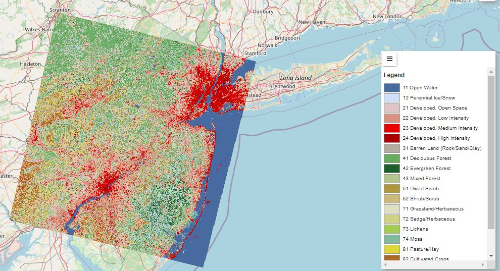

# ClusterDynamics

 

  
  <h3 align="center">Cluster Dynamics</h3>

  

    Exploring Urban and Natural Dynamics with k-Means Clustering
     
    <a href="https://github.com/jbarciv/ClusterDynamics/tree/main/project_report"><strong>Explore the docs »</strong></a>
     
     
    <a href="#usage">Satellite Data</a>
    ·
    <a href="#contact">Contact</a>
  

<!-- TABLE OF CONTENTS -->

  
Table of Contents

  <ol>
    <li>
      <a href="#about-the-project">About The Project</a>
      <ul>
        <li><a href="#built-with">Built With</a></li>
      </ul>
    </li>
    <li>
      <a href="#getting-started">Getting Started</a>
      <ul>
        <li><a href="#prerequisites">Prerequisites</a></li>
        <li><a href="#installation">Installation</a></li>
      </ul>
    </li>
    <li><a href="#usage">Usage</a></li>
    <li><a href="#license">License</a></li>
    <li><a href="#contact">Contact</a></li>
    <li><a href="#acknowledgments">Acknowledgments</a></li>
  </ol>

<!-- ABOUT THE PROJECT -->
## About The Project

The following repository describes a artificial intelligence project with the objective of urban exploration and natural dynamics with k-Means Clustering, developed by students of the Polytechnic University in Madrid (UPM) as part of the course 'Artificial Intelligence'. In this repo it can be found the libraries, results and a collection of the reports produced during the development of this project.

(<a href="#readme-top">back to top</a>)

### Built With

List of major frameworks/libraries used for this project. 

* [Geemap](https://geemap.org/)
* [Scikit-learn](https://scikit-learn.org/stable/)
* [Jupyter Notebooks](https://jupyter.org/)
* [Google Colab](https://colab.research.google.com/?hl=es)

(<a href="#readme-top">back to top</a>)

<!-- USAGE EXAMPLES -->
## Satellite Data

 In this repo we study how clustering behave in different urban scenarios from Europe and US. For this urban clustering study we have used Geemap and Google Colab.

New York

Paris

For the natural dynamics we have focus in Sau and Susqueda reservoirs placed in the northern of Spain (near Girona).

With the help of [Sentinel Hub](https://www.sentinel-hub.com/) we have obtained a suficient data.

Some results for the clustering offer different performance depending on the images as shown below. (1) clusters properly the total water area while (2) is not.

### Results for Reservoirs Shrinkage

The results obtained for the image clustering analysis could be shown in the following figures.

(<a href="#readme-top">back to top</a>)

<!-- LICENSE -->
## License

Distributed under the MIT License. See `LICENSE.txt` for more information.

(<a href="#readme-top">back to top</a>)

<!-- CONTACT -->
## Contact

Jorge Guijarro Tolon - [JTlotus](https://github.com/JTlotus) - jorgeguijarro10@gmail.com\
Josep Mª Barberá Civera - [jbarciv](https://github.com/jbarciv) - chemabc@gmail.com

(<a href="#readme-top">back to top</a>)

<!-- ACKNOWLEDGMENTS -->
## Acknowledgments

Here we list resources we find helpful and would like to give credit to.

* [Sentinel Hub](https://www.sentinel-hub.com/)
* [Landsat News - NASA](https://landsat.visibleearth.nasa.gov/view.php?id=151257)
* [kmean - Oviedo University Labs](https://www.unioviedo.es/compnum/labs/new/kmeans.html)

(<a href="#readme-top">back to top</a>)

